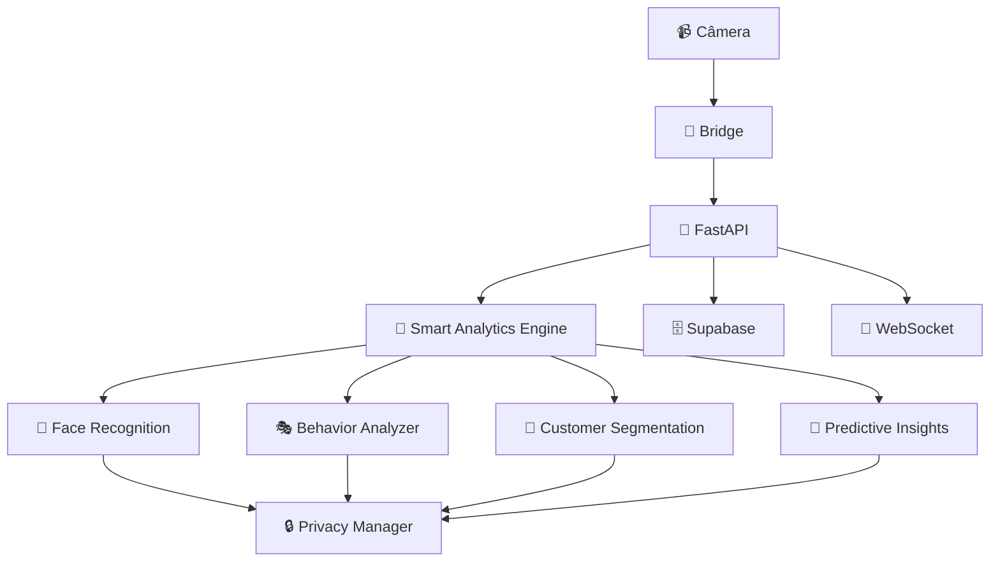

# 🏪 ShopFlow Backend - Sistema Inteligente de Análise de Fluxo

[](https://www.python.org/downloads/)
[](https://fastapi.tiangolo.com/)
[](https://github.com/ultralytics/ultralytics)
[](LICENSE)

## 🎯 O que é o ShopFlow Backend?

Sistema completo de **Inteligência Artificial** para análise de fluxo de pessoas em estabelecimentos comerciais. Utiliza visão computacional avançada para fornecer insights em tempo real sobre comportamento de clientes, otimização de staffing e predições inteligentes.

### ✨ Funcionalidades Principais

- 🎥 **Detecção Inteligente**: YOLO11 para detecção precisa de pessoas
- 👤 **Reconhecimento Facial**: Sistema LGPD-compliant para funcionários  
- 🎭 **Análise Comportamental**: Padrões de movimento e zonas quentes
- 🎯 **Segmentação de Clientes**: Classificação automática de perfis
- 🔮 **Predições IA**: Previsões de fluxo e necessidade de staffing
- 🔒 **Privacidade Total**: Conformidade LGPD/GDPR
- ⚡ **Tempo Real**: WebSocket para métricas instantâneas

## 🚀 Quick Start

### 1️⃣ Instalação Local

```bash
# Clonar repositório
git clone https://github.com/seu-usuario/shopflow-jcplussize.git
cd shopflow-jcplussize/backend

# Criar ambiente virtual
python -m venv venv
source venv/bin/activate  # Linux/Mac
# ou
venv\Scripts\activate     # Windows

# Instalar dependências
pip install -r requirements.txt

# Configurar variáveis (.env)
cp .env.example .env
# Edite o .env com suas configurações

# Executar
python main.py
```

### 2️⃣ Deploy Docker/EasyPanel

```bash
# Build da imagem
docker build -t shopflow-backend .

# Executar container
docker run -p 8001:8001 --env-file .env shopflow-backend
```

### 3️⃣ Verificar Funcionamento

```bash
curl http://localhost:8001/api/health
```

## 🏗️ Arquitetura



## 📊 API Endpoints

### 🏥 Sistema
- `GET /api/health` - Status geral do sistema
- `GET /docs` - Documentação interativa (Swagger)

### 🎥 Câmera
- `POST /api/camera/process` - Processar frame com IA
- `GET /api/camera/status` - Status dos serviços de câmera

### 📈 Analytics
- `GET /api/analytics/smart-metrics` - Métricas inteligentes
- `GET /api/analytics/behavior-patterns` - Padrões comportamentais
- `GET /api/analytics/predictions` - Predições de IA
- `GET /api/analytics/segmentation` - Segmentação de clientes

### 👥 Funcionários
- `POST /api/employees/register` - Registrar funcionário
- `GET /api/employees/list` - Listar funcionários
- `GET /api/employees/{id}` - Detalhes do funcionário
- `DELETE /api/employees/{id}` - Remover funcionário (LGPD)

### 🔒 Privacidade
- `GET /api/privacy/settings` - Configurações de privacidade
- `GET /api/privacy/compliance-report` - Relatório LGPD/GDPR

## ⚙️ Configuração

### Variáveis Essenciais (.env)

```env
# Supabase (obrigatório)
SUPABASE_URL=https://seu-projeto.supabase.co
SUPABASE_ANON_KEY=sua-chave-anonima
SUPABASE_SERVICE_KEY=sua-service-key

# API
API_HOST=0.0.0.0
API_PORT=8001

# Segurança
BRIDGE_API_KEY=sua-chave-segura-aqui

# IA (opcional - valores padrão funcionam)
YOLO_MODEL=yolo11n.pt
YOLO_CONFIDENCE=0.5
```

## 🧠 Smart Analytics Engine

O coração do sistema com 4 módulos especializados:

### 1. 👤 Face Recognition Manager
- Registro seguro de funcionários
- Reconhecimento em tempo real
- Total conformidade LGPD/GDPR
- Direito ao esquecimento

### 2. 🎭 Behavior Analyzer
- Zonas quentes (heatmap)
- Tempo de permanência
- Padrões de movimento
- Detecção de grupos

### 3. 🎯 Customer Segmentation
- Novos clientes
- Clientes regulares
- Clientes VIP
- Funcionários

### 4. 🔮 Predictive Insights
- Previsão de fluxo
- Necessidade de staffing
- Probabilidade de conversão
- Detecção de anomalias

## 📱 Exemplo de Uso

### Processar Frame da Câmera

```python
import requests

# Enviar frame para análise
with open('frame.jpg', 'rb') as f:
    response = requests.post(
        'http://localhost:8001/api/camera/process',
        files={'frame': f},
        data={
            'timestamp': '2025-01-04T10:30:00Z',
            'camera_id': 'cam_001'
        },
        headers={'Authorization': 'Bearer SUA_API_KEY'}
    )

result = response.json()
print(f"Pessoas detectadas: {result['people_count']}")
print(f"Funcionários: {result['employees_detected']}")
```

### WebSocket Tempo Real

```javascript
const ws = new WebSocket('ws://localhost:8001/ws/smart-metrics');

ws.onmessage = function(event) {
    const metrics = JSON.parse(event.data);
    updateDashboard(metrics.data);
};
```

## 🔧 Desenvolvimento

### Estrutura do Projeto

```
backend/
├── main.py                    # Entrada da aplicação
├── requirements.txt           # Dependências
├── Dockerfile                 # Container Docker
│
├── api/routes/               # Endpoints da API
├── core/                     # Núcleo do sistema
│   ├── ai/                   # Módulos de IA
│   ├── config.py            # Configurações
│   └── database.py          # Banco de dados
├── models/                   # Modelos de dados
└── utils/                    # Utilitários
```

### Executar em Modo Debug

```bash
export API_DEBUG=True
python main.py
```

### Testes

```bash
# Testar endpoints principais
curl http://localhost:8001/api/health
curl http://localhost:8001/api/analytics/health  
curl http://localhost:8001/api/camera/status
```

## 📊 Performance

- **Processamento**: 20-50ms por frame
- **Throughput**: 20-50 FPS
- **Detecção YOLO**: 15-30ms
- **Reconhecimento Facial**: 5-15ms

## 🛡️ Segurança & Privacidade

### Conformidade LGPD/GDPR
- ✅ Direito ao acesso
- ✅ Direito à retificação  
- ✅ Direito ao esquecimento
- ✅ Direito à portabilidade
- ✅ Logs de auditoria

### Segurança Técnica
- 🔐 Autenticação via API Key
- 🛡️ CORS configurado
- 📝 Logs estruturados
- 🔍 Validação rigorosa

## 📈 Monitoramento

### Métricas Coletadas
- Performance de processamento
- Precisão das detecções
- Uso de recursos (CPU/memória)
- Contadores por endpoint
- Logs de erro detalhados

### Logs
```bash
# Ver logs em tempo real
tail -f logs/app.log

# Filtrar erros
grep "ERROR" logs/app.log
```

## 🚀 Deploy Produção

### EasyPanel
1. Criar projeto no EasyPanel
2. Conectar repositório Git
3. Configurar variáveis de ambiente
4. Deploy automático

### Docker Compose
```yaml
version: '3.8'
services:
  shopflow-backend:
    build: .
    ports:
      - "8001:8001"
    env_file:
      - .env
    restart: unless-stopped
```

## 🐛 Troubleshooting

### Problemas Comuns

**Erro de conexão Supabase:**
```bash
# Verificar configuração
echo $SUPABASE_URL
```

**Modelo YOLO não encontrado:**
```bash
# Modelo será baixado automaticamente
# Verifique conexão de internet
```

**Permissão negada:**
```bash
# Criar diretórios necessários
mkdir -p uploads logs face_embeddings
chmod 755 uploads logs face_embeddings
```

## 📚 Documentação Completa

Para documentação detalhada, consulte:
- **[Documentação Completa](../docs/BACKEND_DOCUMENTATION.md)** - Guia completo
- **[API Docs](http://localhost:8001/docs)** - Documentação interativa Swagger
- **[Redoc](http://localhost:8001/redoc)** - Documentação alternativa

## 🤝 Contribuindo

1. Fork o projeto
2. Crie uma branch para sua feature (`git checkout -b feature/AmazingFeature`)
3. Commit suas mudanças (`git commit -m 'Add some AmazingFeature'`)
4. Push para a branch (`git push origin feature/AmazingFeature`)
5. Abra um Pull Request

## 📄 Licença

Distribuído sob a licença MIT. Veja `LICENSE` para mais informações.

## 📞 Suporte

- 📧 Email: suporte@shopflow.com
- 🐛 Issues: [GitHub Issues](https://github.com/seu-usuario/shopflow-jcplussize/issues)
- 📖 Docs: [Documentação Completa](../docs/BACKEND_DOCUMENTATION.md)

---

**Feito com ❤️ para revolucionar o varejo com Inteligência Artificial**