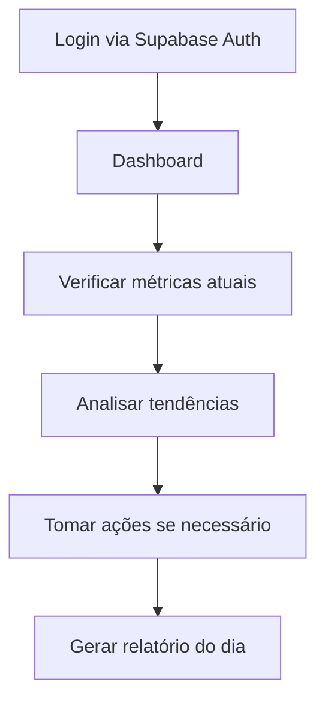
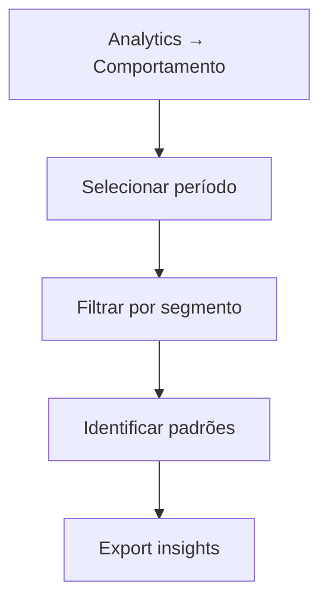

# 📋 PRD - FRONTEND SHOPFLOW

## 1. VISÃO GERAL DO PRODUTO

### 🎯 Objetivo
Criar uma interface web moderna e intuitiva utilizando Next.js 15 com App Router e integração nativa com Supabase para visualização e gestão do sistema de contagem inteligente de pessoas, oferecendo insights em tempo real sobre o comportamento de clientes e funcionários na loja.

### 👥 Usuários-Alvo

| Perfil | Responsabilidades | Necessidades |
|--------|------------------|--------------|
| **Gerentes de Loja** | Monitoramento diário e decisões operacionais | Dashboard em tempo real, alertas, relatórios diários |
| **Proprietários** | Visão estratégica e análises de desempenho | Analytics avançados, comparações, ROI |
| **Supervisores** | Gestão de funcionários e operações | Controle de presença, produtividade |
| **Analistas** | Relatórios e insights detalhados | Exportação de dados, segmentação, predições |

---

## 2. REQUISITOS FUNCIONAIS

### 2.1 📊 Dashboard Principal

#### Widget de Métricas em Tempo Real
- ✅ Contador ao vivo de pessoas na loja
- ✅ Separação visual clientes vs funcionários
- ✅ Taxa de ocupação (com limite máximo configurável)
- ✅ Indicador de tendência (subindo/descendo)

#### Gráfico de Fluxo Temporal
- ✅ Linha do tempo últimas 24h
- ✅ Comparação com média histórica
- ✅ Marcadores de eventos importantes
- ✅ Zoom e pan interativo

#### Mapa de Calor da Loja
- ✅ Visualização 2D do layout
- ✅ Zonas quentes em gradiente de cor
- ✅ Atualização em tempo real via Supabase Realtime
- ✅ Tooltip com detalhes ao hover

#### Cards de KPIs
- ✅ Total de visitantes hoje
- ✅ Taxa de conversão
- ✅ Tempo médio de permanência
- ✅ Ticket médio (se integrado com PDV)

### 2.2 📹 Módulo de Câmeras

#### Grid de Visualização
- ✅ Até 4 câmeras simultâneas
- ✅ Modo individual ou grid
- ✅ Indicador de status (online/offline)
- ✅ FPS e qualidade da stream

#### Controles de Câmera
- ✅ Play/Pause individual
- ✅ Snapshot manual
- ✅ Fullscreen
- ✅ Configurações de qualidade

#### Overlay de Detecção
- ✅ Bounding boxes de pessoas
- ✅ Labels (Cliente/Funcionário)
- ✅ Confidence score
- ✅ Tracking IDs

### 2.3 👥 Gestão de Funcionários

#### Lista de Funcionários
- ✅ Tabela com busca e filtros
- ✅ Status (ativo/inativo)
- ✅ Última vez visto
- ✅ Horas trabalhadas

#### Cadastro de Funcionário
- ✅ Formulário com upload de foto
- ✅ Validação de campos
- ✅ Preview da foto
- ✅ Confirmação de privacidade LGPD

#### Análise de Presença
- ✅ Calendário de presença
- ✅ Gráfico de horas por período
- ✅ Relatório de pontualidade
- ✅ Export para Excel/PDF

### 2.4 📈 Analytics Avançado

#### Painel de Comportamento
- ✅ Fluxo de movimento (flow patterns)
- ✅ Análise de grupos
- ✅ Tempo em cada zona
- ✅ Jornada do cliente

#### Segmentação de Clientes
- ✅ Pizza chart de tipos
- ✅ Tabela detalhada
- ✅ Evolução temporal
- ✅ Ações recomendadas

#### Predições e Insights
- ✅ Previsão próximas horas
- ✅ Alertas de anomalias
- ✅ Recomendações de staff
- ✅ Oportunidades identificadas

#### Comparações
- ✅ Período vs período
- ✅ Dia da semana
- ✅ Sazonalidade
- ✅ Benchmarks

### 2.5 ⚙️ Configurações

#### Privacidade
- ✅ Toggle reconhecimento facial
- ✅ Configurar retenção de dados
- ✅ Audit logs
- ✅ Export LGPD

#### Sistema
- ✅ Limites de ocupação
- ✅ Horário de funcionamento
- ✅ Zonas da loja
- ✅ Notificações

#### Integrações
- ✅ Webhooks
- ✅ API keys
- ✅ Backup automático no Supabase

### 2.6 📄 Relatórios Web

#### Templates Prontos
- ✅ Relatório diário
- ✅ Análise semanal
- ✅ Resumo mensal
- ✅ Performance YoY

#### Personalização
- ✅ Ajuste flexível entre datas
- ✅ Filtros customizáveis
- ✅ Métricas selecionáveis

---

## 3. REQUISITOS NÃO-FUNCIONAIS

### 3.1 ⚡ Performance
| Métrica | Target | Ferramenta |
|---------|--------|------------|
| Carregamento inicial | < 3 segundos | Lighthouse |
| Atualização real-time | < 100ms | Supabase Realtime |
| Suporte eventos | 1000+/segundo | Load testing |
| Cache inteligente | 95% hit rate | TanStack Query |

### 3.2 🎨 Usabilidade
- ✅ Interface intuitiva e moderna
- ✅ Tooltips contextuais
- ✅ Responsividade total
- ✅ Acessibilidade básica (WCAG AA)

### 3.3 🔒 Segurança
- ✅ Autenticação via Supabase Auth
- ✅ Row Level Security (RLS) no Supabase
- ✅ Rate limiting nas APIs
- ✅ Criptografia de dados sensíveis

### 3.4 🌐 Compatibilidade
- ✅ Chrome 90+, Firefox 88+, Safari 14+
- ✅ Tablets e smartphones
- ✅ Resolução mínima 1366x768
- ✅ Progressive Web App (PWA)

---

## 4. FLUXOS DE USUÁRIO PRINCIPAIS

### Flow 1: Monitoramento Diário


### Flow 2: Cadastro de Funcionário
```mermaid
graph TD
    A[Menu → Funcionários] --> B[Botão "Novo Funcionário"]
    B --> C[Preencher dados + upload foto]
    C --> D[Confirmar termos LGPD]
    D --> E[Salvar no Supabase e treinar IA]
```

### Flow 3: Análise de Conversão


---

## 5. ESTRUTURA DE NAVEGAÇÃO

```
├── 🏠 Dashboard (Home)
├── 📹 Câmeras
│   ├── Visualização ao Vivo
│   └── Configurações
├── 📊 Analytics
│   ├── Tempo Real
│   ├── Comportamento
│   ├── Segmentação
│   └── Predições
├── 👥 Funcionários
│   ├── Lista
│   ├── Cadastro
│   └── Presença
├── 📈 Relatórios
│   ├── Gerar
│   └── Histórico
└── ⚙️ Configurações
    ├── Sistema
    ├── Privacidade
    └── Integrações
```

---

## 6. STACK TECNOLÓGICA

### 🚀 Core Framework
| Tecnologia | Versão | Propósito |
|------------|--------|-----------|
| **Next.js** | 15 | Framework React com App Router |
| **TypeScript** | 5+ | Type safety |
| **Tailwind CSS** | 3+ | Estilização utilitária |
| **Shadcn/ui** | Latest | Componentes acessíveis |

### 🗄️ Integração Supabase
```typescript
// Principais pacotes
"@supabase/supabase-js"           // Cliente oficial
"@supabase/auth-helpers-nextjs"   // Autenticação
"@supabase/realtime-js"          // Dados em tempo real
"@supabase/storage-js"           // Upload de arquivos
```

### 🔄 Estado e Data Fetching
- **TanStack Query** - Cache e sincronização com Supabase
- **Zustand** - Estado global simplificado
- **SWR** - Real-time updates

### 📊 Visualizações
- **Recharts** - Gráficos responsivos
- **D3.js** - Visualizações complexas
- **React-Grid-Layout** - Dashboards customizáveis
- **Framer Motion** - Animações fluidas

### 📡 Comunicação
- **Supabase Realtime** - WebSocket nativo
- **Axios** - REST API do backend
- **EventSource** - Server-Sent Events

### 🛠️ Utilitários
- **React Hook Form + Zod** - Formulários validados
- **Date-fns** - Manipulação de datas
- **React-Dropzone** - Upload de arquivos
- **Sonner** - Notificações elegantes

---

## 7. CONSIDERAÇÕES DE IMPLEMENTAÇÃO

### 🏗️ Arquitetura
- ✅ App Router do Next.js 15 para roteamento moderno
- ✅ Server Components para melhor performance
- ✅ Code splitting automático
- ✅ Incremental Static Regeneration (ISR)

### 🔌 Integração Supabase

```typescript
// Configuração do cliente Supabase
import { createClient } from '@supabase/supabase-js'

const supabaseUrl = process.env.NEXT_PUBLIC_SUPABASE_URL
const supabaseAnonKey = process.env.NEXT_PUBLIC_SUPABASE_ANON_KEY

export const supabase = createClient(supabaseUrl, supabaseAnonKey)
```

### 📡 Realtime Subscriptions

```typescript
// Exemplo de subscription para métricas em tempo real
supabase
  .channel('realtime-metrics')
  .on('postgres_changes', 
    { event: '*', schema: 'public', table: 'camera_events' },
    (payload) => updateMetrics(payload.new)
  )
  .subscribe()
```

### ⚡ Otimizações
- ✅ Virtual scrolling para listas grandes
- ✅ Debounce em filtros e buscas
- ✅ Lazy loading de imagens e componentes
- ✅ Optimistic updates para melhor UX

### 🔐 Segurança com Supabase
- ✅ Row Level Security (RLS) em todas as tabelas
- ✅ Políticas de acesso por tipo de usuário
- ✅ Auth middleware no Next.js
- ✅ Validação server-side com Zod

---

## 8. ROADMAP DE DESENVOLVIMENTO

### 📅 Sprint 1-2: Fundação (2 semanas)
- [ ] Setup Next.js 15 + TypeScript + Tailwind
- [ ] Integração Supabase (Auth + Database + Realtime)
- [ ] Layout base e navegação
- [ ] Autenticação funcional

### 📅 Sprint 3-4: Dashboard (2 semanas)
- [ ] Widgets de métricas em tempo real
- [ ] Gráficos de fluxo temporal
- [ ] Cards de KPIs
- [ ] WebSocket com Supabase Realtime

### 📅 Sprint 5-6: Câmeras (2 semanas)
- [ ] Grid de visualização
- [ ] Controles de stream
- [ ] Overlay de detecções
- [ ] Status em tempo real

### 📅 Sprint 7-8: Funcionários (2 semanas)
- [ ] CRUD de funcionários
- [ ] Upload de fotos para Supabase Storage
- [ ] Análise de presença
- [ ] Relatórios

### 📅 Sprint 9-10: Analytics (2 semanas)
- [ ] Painéis de comportamento
- [ ] Segmentação de clientes
- [ ] Predições e insights
- [ ] Comparações temporais

### 📅 Sprint 11-12: Finalização (2 semanas)
- [ ] Configurações completas
- [ ] Relatórios customizáveis
- [ ] Testes E2E
- [ ] Deploy e documentação

---

## 9. MÉTRICAS DE SUCESSO

### 📊 Técnicas
| Métrica | Target | Ferramenta de Medição |
|---------|--------|-----------------------|
| Performance | 95% uptime, <3s load time | Lighthouse, Uptime Robot |
| Real-time | Latência <100ms para atualizações | Custom metrics |
| Escalabilidade | Suporte 100+ usuários simultâneos | Load testing |

### 💼 Negócio
| Métrica | Target | KPI |
|---------|--------|-----|
| Adoção | 80% dos usuários ativos diariamente | DAU/MAU |
| Satisfação | NPS > 70 | Pesquisas trimestrais |
| ROI | Redução 30% em perdas | Comparação YoY |
| Conversão | Aumento 20% em vendas | Analytics integrado |

### 🏆 Qualidade
| Métrica | Target | Ferramenta |
|---------|--------|------------|
| Cobertura de testes | >80% | Jest + Testing Library |
| Lighthouse Score | >90 | CI/CD pipeline |
| Zero downtime | 99.9% uptime | Blue-green deploys |
| Bugs críticos | <2 por mês | Issue tracking |

---

## 10. ARQUITETURA DE PASTAS

```
frontend/
├── src/
│   ├── app/                    # App Router (Next.js 15)
│   │   ├── (auth)/            # Rotas autenticadas
│   │   │   ├── dashboard/
│   │   │   ├── cameras/
│   │   │   ├── analytics/
│   │   │   ├── employees/
│   │   │   └── reports/
│   │   ├── globals.css
│   │   ├── layout.tsx
│   │   └── page.tsx
│   ├── components/            # Componentes reutilizáveis
│   │   ├── ui/               # Componentes base (shadcn/ui)
│   │   ├── layout/           # Layout components
│   │   ├── charts/           # Gráficos e visualizações
│   │   └── forms/            # Formulários
│   ├── hooks/                # Custom hooks
│   ├── lib/                  # Utilitários
│   │   ├── supabase.ts      # Cliente Supabase
│   │   ├── utils.ts         # Funções utilitárias
│   │   └── validations.ts   # Schemas Zod
│   ├── store/               # Estado global (Zustand)
│   ├── types/               # Definições TypeScript
│   └── utils/               # Utilitários diversos
├── public/                  # Assets estáticos
├── docs/                   # Documentação
├── tests/                  # Testes E2E e unitários
└── package.json
```

---

## 11. CONFIGURAÇÕES IMPORTANTES

### 🔧 Next.js Config

```typescript
// next.config.js
/** @type {import('next').NextConfig} */
const nextConfig = {
  experimental: {
    appDir: true,
  },
  images: {
    domains: ['your-supabase-project.supabase.co'],
  },
  env: {
    NEXT_PUBLIC_SUPABASE_URL: process.env.NEXT_PUBLIC_SUPABASE_URL,
    NEXT_PUBLIC_SUPABASE_ANON_KEY: process.env.NEXT_PUBLIC_SUPABASE_ANON_KEY,
  },
}

module.exports = nextConfig
```

### 🎨 Tailwind Config

```typescript
// tailwind.config.ts
import type { Config } from 'tailwindcss'

const config: Config = {
  content: [
    './src/pages/**/*.{js,ts,jsx,tsx,mdx}',
    './src/components/**/*.{js,ts,jsx,tsx,mdx}',
    './src/app/**/*.{js,ts,jsx,tsx,mdx}',
  ],
  theme: {
    extend: {
      colors: {
        // Design system colors
      },
      animation: {
        // Custom animations
      },
    },
  },
  plugins: [require("tailwindcss-animate")],
}
export default config
```

### 📦 Package.json Essenciais

```json
{
  "dependencies": {
    "next": "15.0.0",
    "react": "^18.2.0",
    "typescript": "^5.0.0",
    "@supabase/supabase-js": "^2.38.0",
    "@supabase/auth-helpers-nextjs": "^0.8.0",
    "@tanstack/react-query": "^5.0.0",
    "recharts": "^2.8.0",
    "framer-motion": "^10.16.0",
    "zustand": "^4.4.0",
    "react-hook-form": "^7.45.0",
    "zod": "^3.22.0",
    "tailwindcss": "^3.3.0"
  },
  "devDependencies": {
    "@types/node": "^20.0.0",
    "@types/react": "^18.2.0",
    "eslint": "^8.45.0",
    "prettier": "^3.0.0",
    "@testing-library/react": "^13.4.0",
    "jest": "^29.6.0"
  }
}
```

---

## 12. CONSIDERAÇÕES FINAIS

Este PRD foi otimizado para aproveitar ao máximo as capacidades do **Supabase** integrado com **Next.js 15**, garantindo:

### ✅ **Benefícios Técnicos**
- 🚀 **Sincronização em tempo real** via Supabase Realtime
- 🔐 **Autenticação robusta** com Supabase Auth
- 💾 **Storage seguro** para fotos de funcionários
- ⚡ **Performance otimizada** com Server Components
- 📈 **Escalabilidade** com edge functions
- 🛡️ **Conformidade LGPD** com RLS e políticas

### ✅ **Benefícios de Negócio**
- 📊 **Insights em tempo real** para tomada de decisão
- 💰 **Redução de custos** operacionais
- 📈 **Aumento da conversão** através de dados
- 🎯 **Experiência otimizada** do cliente
- 📱 **Acessibilidade total** (web e mobile)

### ✅ **Benefícios de Desenvolvimento**
- 🔄 **Desenvolvimento ágil** com tecnologias modernas
- 🧪 **Testabilidade** completa
- 📚 **Documentação** abrangente
- 🔧 **Manutenibilidade** a longo prazo
- 🚀 **Deploy simplificado** com Vercel/Supabase

---

**Status do Documento**: ✅ Aprovado para desenvolvimento  
**Última Atualização**: 06/09/2025  
**Próxima Revisão**: Sprint Review (a cada 2 semanas)